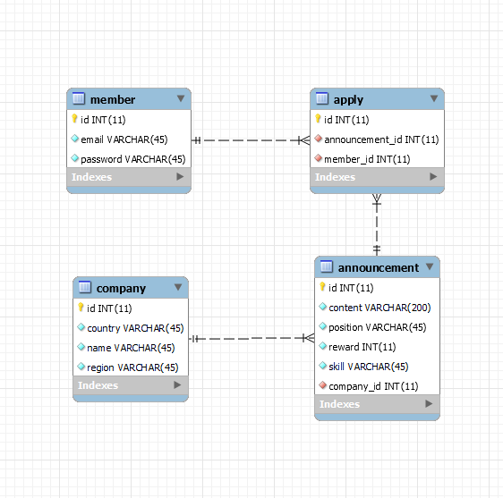

# wanted-pre-onboarding-backend
원티드 프리온보딩 백엔드 인턴십 선발과제

## 🧑‍💻 채용서비스️
기업의 채용을 위한 웹 서비스 입니다.<br>
회사는 채용공고를 생성하고, 이에 사용자는 지원합니다.

## 📅 개발 기간
23.10.06 ~ 23.10.09

## ⚙️ 개발 환경
- **Language**: Java 17
- **IDE**: IntelliJ IDEA
- **Framework**: Spring Boot 3.1.4
- **Dependencies**: Spring Web, Spring Boot DevTools, Spring Data JPA, Lombok, QueryDSL
- **Build**: Gradle
- **Database**: Sqlite

## 🔑 ERD


## 📌 주요 기능
1️⃣ 채용공고 등록
---

➡️ 회사는 아래 데이터와 같이 채용공고를 등록합니다.

- `POST /api/announcement`

```json
{
      "회사_id": 1,
      "채용포지션": "백엔드 주니어 개발자",
      "채용보상금": 1000000,
      "채용내용": "원티드랩에서 백엔드 주니어 개발자를 채용합니다. 자격요건은..",
      "사용기술": "Python"
}
```

2️⃣ 채용공고 수정
---

➡️ 회사는 아래 데이터와 같이 채용공고를 수정합니다. (회사 id 이외 모두 수정 가능합니다.)

- `PUT /api/announcement`

```json
{
      "채용포지션": "백엔드 주니어 개발자",
      "채용보상금": 1500000,
      "채용내용": "원티드랩에서 백엔드 주니어 개발자를 '적극' 채용합니다. 자격요건은..",
      "사용기술": "Python"
}
```

3️⃣ 채용공고 삭제
---

➡️ DB에서 삭제됩니다.

- `DELETE /api/announcement/{id}`

4️⃣ 채용공고 목록
---

➡️ 사용자는 채용공고 목록을 아래와 같이 확인할 수 있습니다.

- `GET /api/announcement`

```json
[
    {
        "채용공고_id": 1,
        "회사명": "원티드랩",
        "국가": "한국",
        "지역": "서울",
        "채용포지션": "백엔드 주니어 개발자",
        "채용보상금": 1500000,
        "사용기술": "Python"
    },
    {
        "채용공고_id": 2,
        "회사명": "네이버",
        "국가": "한국",
        "지역": "판교",
        "채용포지션": "Django 백엔드 개발자",
        "채용보상금": 1000000,
        "사용기술": "Django"
    },
    ...
]
```

5️⃣ 채용공고 검색 기능 구현.
---

- `GET /api/announcement/search?keyword=원티드`

```json
[
    {
        "채용공고_id": 1,
        "회사명": "원티드랩",
        "국가": "한국",
        "지역": "서울",
        "채용포지션": "백엔드 주니어 개발자",
        "채용보상금": 1500000,
        "사용기술": "Python"
    },
    {
        "채용공고_id": 2,
        "회사명": "원티드코리아",
        "국가": "한국",
        "지역": "부산",
        "채용포지션": "프론트엔드 개발자",
        "채용보상금": 500000,
        "사용기술": "javascript"
    }
]
```

- `GET /api/announcement/search?keyword=Django`

```json
[
    {
          "채용공고_id": 3,
          "회사명":"네이버",
          "국가":"한국",
          "지역":"판교",
          "채용포지션":"Django 백엔드 개발자",
          "채용보상금":1000000,
          "사용기술":"Django"
    },
    {
          "채용공고_id": 4,
          "회사명":"카카오",
          "국가":"한국",
          "지역":"판교",
          "채용포지션":"Django 백엔드 개발자",
          "채용보상금":500000,
          "사용기술":"Python"
    }
    ...
]
```
6️⃣ 채용 상세 페이지를 가져옵니다.
---

➡️ 사용자는 채용상세 페이지를 아래와 같이 확인할 수 있습니다.<br>
“채용내용”이 추가적으로 담겨있음.<br>
해당 회사가 올린 다른 채용공고 가 추가적으로 포함됩니다.

- `GET /api/announcement/{id}`

```json
{
      "채용공고_id": 1,
      "회사명": "원티드랩",
      "국가": "한국",
      "지역": "서울",
      "채용포지션": "백엔드 주니어 개발자",
      "채용보상금": 1500000,
      "사용기술": "Python",
      "채용내용": "원티드랩에서 백엔드 주니어 개발자를 채용합니다. 자격요건은..",
      "회사가올린다른채용공고": [
        2,
        3
      ]
}
```
7️⃣ 사용자는 채용공고에 지원합니다.
---

➡️ 사용자는 채용공고에 아래와 같이 지원합니다.<br>
사용자는 1회만 지원 가능합니다.

- `POST /api/apply`

```json
{
      "채용공고_id": 1,
      "사용자_id": 2
}
```
---

## Postman
➡️[Postman Documentation 열기](https://documenter.getpostman.com/view/20877689/2s9YJgVMUM)